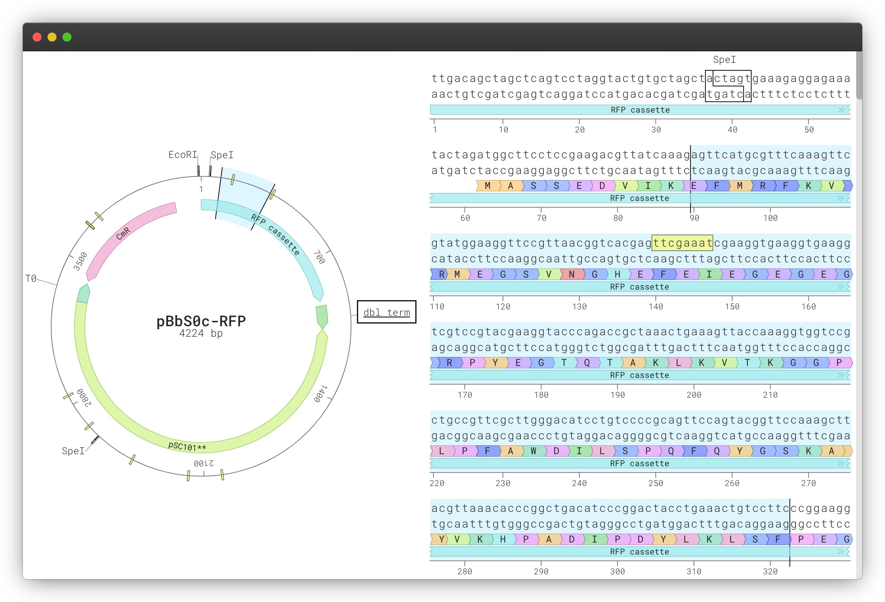

<div align="center">
  
</div>

<div align="center">
  
</div>

`SeqViz` is a DNA, RNA, and protein sequence viewer.

#### Used By

<div align="left">
  
  &nbsp; &nbsp; &nbsp; &nbsp;
  
  &nbsp; &nbsp; &nbsp; &nbsp;
  
  &nbsp; &nbsp; &nbsp; &nbsp;
  
</div>

## Table of Contents

- [Demo](#demo)
- [Features](#features)
- [Usage](#usage)
  - [Installation](#installation)
  - [Instantiation](#instantiation)
  - [Props](#props)
  - [Without React](#without-react)
- [Contact Us](#contact-us)

## Demo

You can see a demo at [tools.latticeautomation.com/seqviz](https://tools.latticeautomation.com/seqviz). The source is in [/demo](./demo).

## Features

### Linear and Circular Sequence Viewer

- Annotations with names and colors
- Amino acid translations
- Enzyme cut sites
- Searching with mismatches and highlighting

### Sequence and Element Selection

- Selecting a range on the viewer(s), or clicking an `annotation`, `translation`, `cutSite` or `searchResult`, will highlight the selection and pass it to the `onSelection()` callback.

## Usage

### Installation

#### npm

```bash
npm install seqviz
```

#### CDN

```html
<script src="https://unpkg.com/seqviz"></script>
```

### Instantiation

#### React

```jsx
import { SeqViz } from "seqviz";

export default () => (
  <SeqViz
    name="J23100"
    seq="TTGACGGCTAGCTCAGTCCTAGGTACAGTGCTAGC"
    annotations={[{ name: "promoter", start: 0, end: 34, direction: 1, color: "blue" }]}
  />
);
```

#### Non-React

More details are in the [Viewer without React](#without-react) section.

```html
<script>
  window.seqviz
    .Viewer("root", {
      name: "L09136",
      seq: "tcgcgcgtttcggtgatgacggtgaaaacctctgacacatgca",
      style: { height: "100vh", width: "100vw" },
    })
    .render();
</script>
```

### Props

All the following are usable as props for the React component (`seqviz.SeqViz`) or as options for the plain JS implementation (`seqviz.Viewer()`).

#### Required

#### `seq (='')`

A sequence to render. Can be a DNA, RNA, or amino acid sequence.

#### File or Accession

These props are `@deprecated` and may be removed in a future major release. We recommend parsing sequence files outside of `SeqViz` with the [`seqparse` package](https://github.com/Lattice-Automation/seqparse).

- `file` is a FASTA, GenBank, SnapGene, JBEI, or SBOL file (`string` | [`File`](https://developer.mozilla.org/en-US/docs/Web/API/File))
- `accession` is an NCBI accession-ID (`string`)

For example:

```jsx
import seqparse from "seqparse";

export default () => {
  const [seq, setSeq] = useState({ name: "", seq: "", annotations: [] });

  // fetch and parse a sequence from NCBI: https://www.ncbi.nlm.nih.gov/nuccore/MN623123.1
  useEffect(async () => setSeq(await seqparse("MN623123.1")));

  return <SeqViz name={seq.name} seq={seq.seq} annotations={seq.annotations} />;
};
```

#### Optional

#### `viewer (='both')`

The type and orientation of the sequence viewers. One of `"linear" | "circular" | "both" | "both_flip"`. `both` means the circular viewer fills the left side of SeqViz, and the linear viewer fills the right. `both_flip` is the opposite: the linear viewer is on the left, and the circular viewer is on the right.

#### `name (='')`

The name of the sequence/plasmid. Shown at the center of the circular viewer.

#### `annotations (=[])`

An array of `Annotation`s to render. Each `Annotation` requires 0-based start (inclusive) and end (exclusive) indexes. `name`s are rendered on top of the annotations. Set the annotation's direction to `1` for forward arrows and `-1` for reverse arrows.

```js
annotations = [
  { start: 0, end: 22, name: "Strong promoter", direction: 1 }, // [0, 22)
  { start: 23, end: 273, name: "GFP" },
  { start: 300, end: 325, name: "Weak promoter", direction: -1, color: "#FAA887" },
];
```

In the example above, the "Strong promoter" would span the first to twenty-second base pair.

#### `translations (=[])`

An array of `translations`: sequence ranges to translate and render as amino acids sequences. Requires 0-based `start` (inclusive) and `end` (exclusive) indexes relative the DNA sequence. A direction is required: `1` (FWD) or `-1` (REV).

```js
translations = [
  { start: 0, end: 90, direction: 1 }, // [0, 90)
  { start: 191, end: 522, direction: -1 },
];
```

#### `enzymes (=[])`

An array of restriction `enzymes` to show recognition sites for. A list of pre-defined enzymes in [src/enzymes.ts](src/enzymes.ts) can be referenced by name. Example:

```js
enzymes = [
  "EcoRI",
  "PstI",
  {
    name: "Cas9",
    rseq: "NGG", // recognition sequence
    fcut: 0, // cut index on FWD strand, relative to start of rseq
    rcut: 1, // cut index on REV strand, relative to start of rseq
    color: "#D7E5F0", // color to highlight recognition site with
    // (optional) only show recognition sites between 100th and 250th index [100, 250)
    range: {
      start: 100,
      end: 250,
    },
  },
];
```

#### `highlights (=[])`

Ranges of sequence to highlight. A default color from `colors` is used if none is provided.

```js
highlights = [
  { start: 36, end: 66, color: "magenta" },
  { start: 70, end: 80 },
];
```

#### `zoom (={ linear: 50 })`

How zoomed the viewer(s) should be `0-100`. Key'ed by viewer type, but only `linear` is supported.

#### `colors (=[])`

An array of colors to use for annotations, translations, and highlights. Defaults are in [src/colors.ts](src/colors.ts).

#### `bpColors (={})`

An object mapping base pairs to their color. The key/bp is either a nucleotide type or 0-based index. Example:

```js
bpColors = { A: "#FF0000", T: "blue", 12: "#00FFFF" };
```

#### `style (={})`

Style for `seqviz`'s outer container div. Empty by default. Useful for setting the height and width of the viewer if the element around `seqviz` lacks one. For example:

```js
style = { height: "100vh", width: "100vw" };
```

#### `selection (={})`

This (optional) `selection` prop is useful if you want to externally manage and set the `selection` state:

```js
selection = {
  start: 133,
  end: 457,
  clockwise: true,
};
```

#### `onSelection (=(_: Selection) => {})`

A callback executed after selection events. It accepts a single [`Selection` type](https://github.com/Lattice-Automation/seqviz/blob/01f6e7b956d18281d4d901b47c4a4becd75f0dc6/src/handlers/selection.tsx#L19) argument.

This occurs after drag/drop selections and clicks. It will have meta on `annotation`, `translation`, `enzyme`, `highlight` or `search` elements if one was selected. The example below shows an `annotation` selection:

```js
{
  "end": 457,
  "length": 324,
  "name": "lacZ fragment",
  "start": 133,
  "type": "ANNOTATION",
}
```

#### `search (={})`

Sequence search parameters. Takes a `query` sequence and the [maximum allowable `mismatch`](https://en.wikipedia.org/wiki/Hamming_distance) for a match (default: 0). Matches are highlighted.

```js
search = { query: "aatggtctc", mismatch: 1 };
```

Searching supports wildcard symbols, e.g. `{ query: "AANAA" }`. All symbols supported are in [src/sequence.ts](src/sequence.ts).

#### `onSearch (=(_: Range) => {})`

A callback executed after a search event. This is called once on initial render and every time the sequence changes thereafter. An example of search results is below:

```js
[
  {
    start: 728,
    end: 733,
    direction: 1,
    index: 0,
  },
  {
    start: 1788,
    end: 1793,
    direction: -1,
    index: 1,
  },
];
```

#### `copyEvent (=(e: KeyboardEvent) => e.key === "c" && (e.metaKey || e.ctrlKey))`

A function returning whether to copy the viewer(s) current selection during a keyboard event. The default method copies sequence after any `ctrl+c` or `meta+c` keyboard events.

#### `showComplement (=true)`

Whether to show the complement sequence.

#### `rotateOnScroll (=true)`

By default, the circular viewer rotates when scrolling over the viewer. That can be disabled with rotateOnScroll: false.

#### `Custom Rendering`

This makes use of the `children`, `linearRef` and `circularRef` props to allow custom rendering of the sequence viewers.  For example, you can do this to render the linear viewer above the circular viewer:

```jsx
import { useRef } from "react";
import { SeqViz, Linear, Circular } from "seqviz";

export default () => {
  const linearRef = useRef();
  const circularRef = useRef();
  return (
    <SeqViz
      name="J23100"
      seq="TTGACGGCTAGCTCAGTCCTAGGTACAGTGCTAGC"
      linearRef={linearRef}
      curcularRef={circularRef}
    >
      {({ circularProps, linearProps, ...props }) => (
        <div
          style={{ display: "flex", flexDirection: "column", width: "100%" }}
        >
          <div ref={linearRef} style={{ height: "25%", width: "100%" }}>
            <Linear {...linearProps} {...props} />
          </div>
          <div ref={circularRef} style={{ height: "75%", width: "100%" }}>
            <Circular {...circularProps} {...props} />
          </div>
        </div>
      )}
    </SeqViz>
  );
};

```

### Without React

For usability in non-React apps, we provide a thin wrapper around the React component. The viewer's constructor accepts two arguments:

- `element`: either an element id or an [HTMLElement](https://developer.mozilla.org/en-US/docs/Web/API/HTMLElement)
- `props`: props as documented [above](#optionsprops)

```js
const element = document.getElementById("root");
const viewer = seqviz.Viewer(element, props);
// Render the viewer to the DOM at the node passed in $element`.
viewer.render();
// To later update the viewer's configuration and re-renders.
viewer.setState(props);
// To render the viewer, eg for server-side rendering, and returns it as an HTML string.
viewer.renderToString();
```

## Contact Us

This library is maintained by <!-- pkg-author(cmd:) -->[Lattice Automation](https://latticeautomation.com/)<!-- /pkg-author -->.

You can report bugs and request features at <!-- pkg-bug-url(cmd:) -->[Issues](https://github.com/Lattice-Automation/seqviz/issues)<!-- /pkg-bug-url --> or contact us directly at <!-- pkg-bug-email(cmd:) -->[contact@latticeautomation.com](contact@latticeautomation.com)<!-- /pkg-bug-email -->
